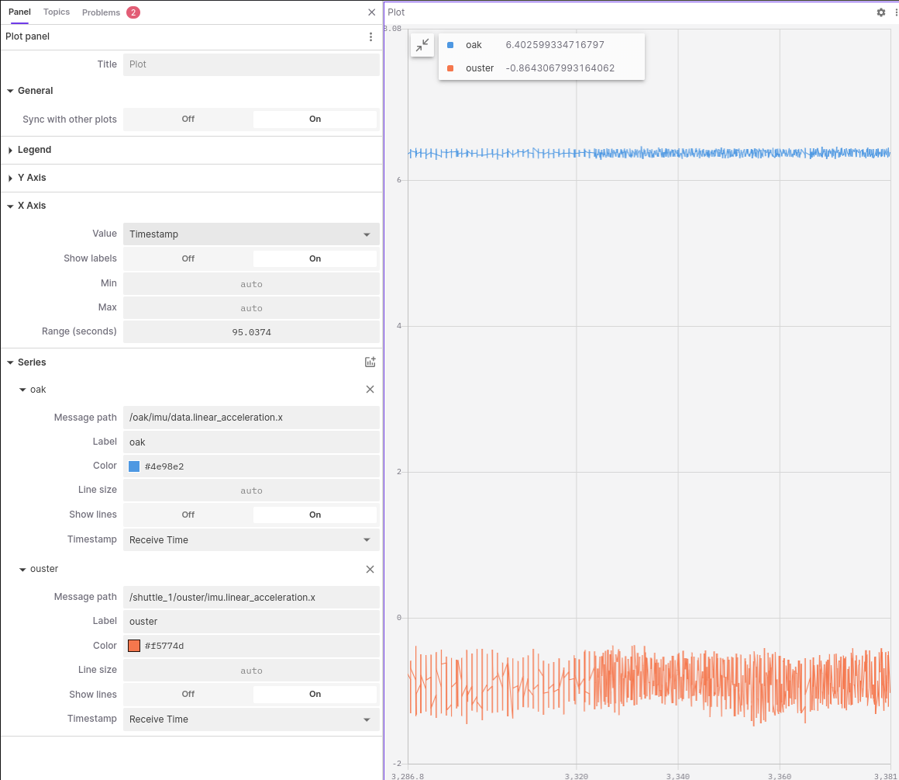
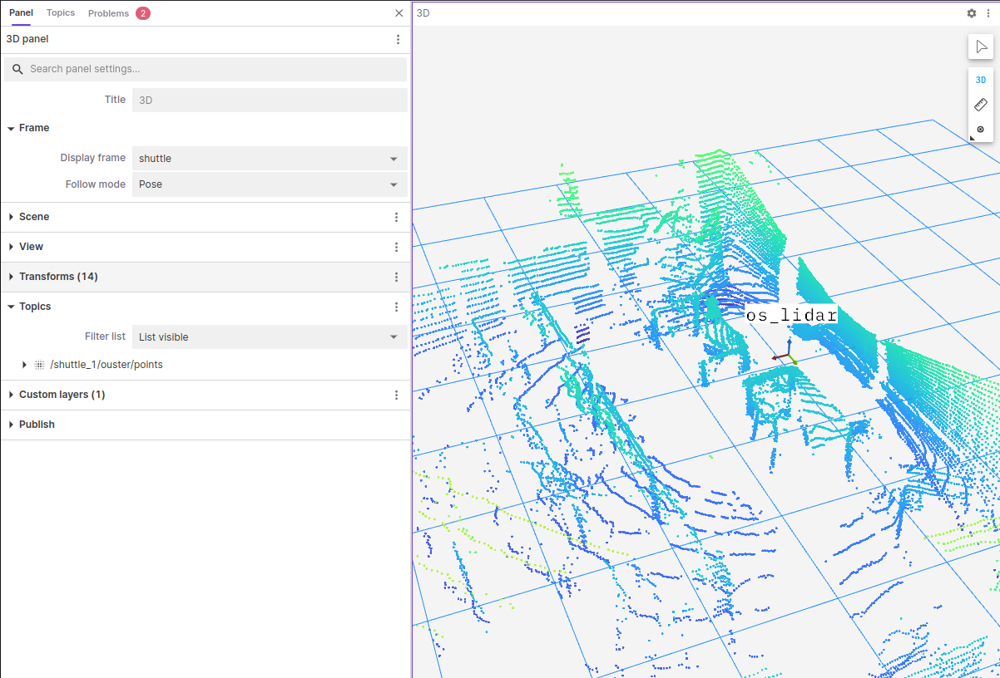
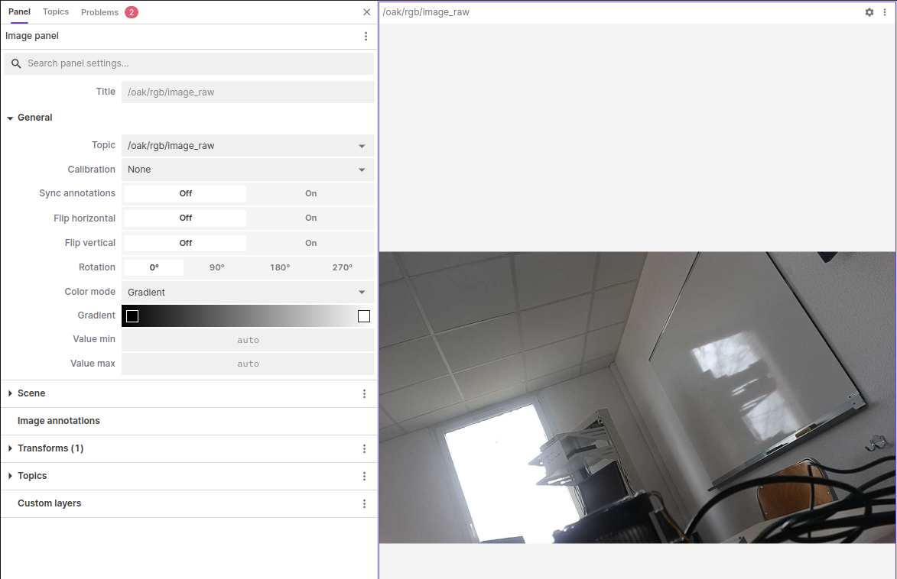

# Foxglove

## Connexion au réseau

Appuyer sur "Open connection", et connectez vous à l'adresse :

``` bash
ws://100.64.212.88:8765
```

## Interface

L'interface est simple à prendre en main. Basiquement, il suffit d'ahouter différents types de pannels (3D, plot, ...) et de renseigner les paramètres demandés.

### Exemples

- Unité de mesure inertielle (IMU)



- LIDAR



- Caméra

