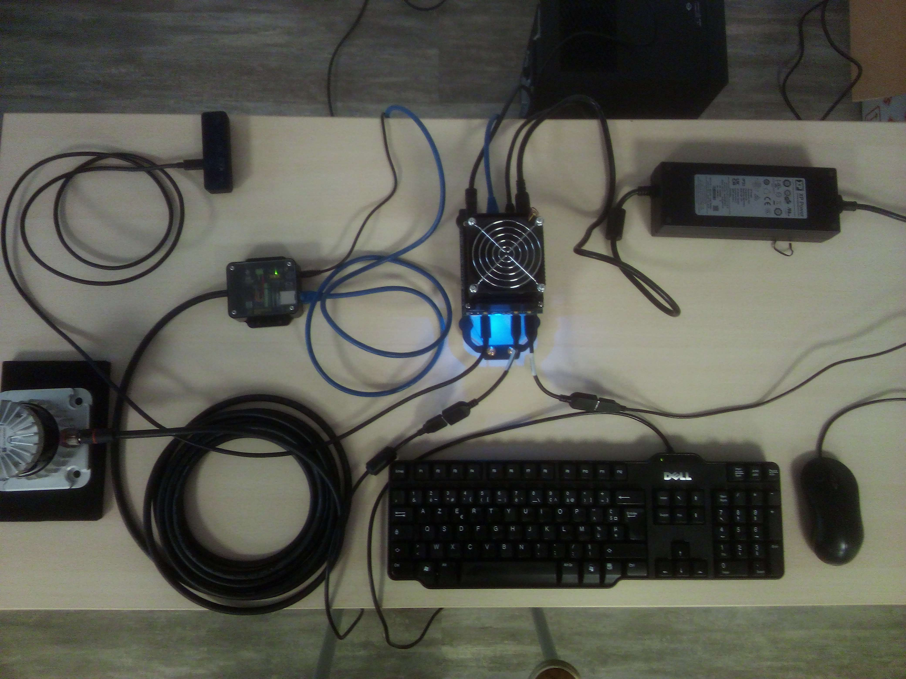
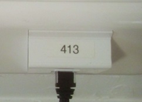
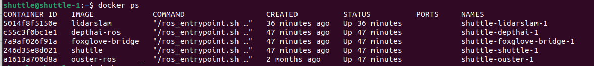
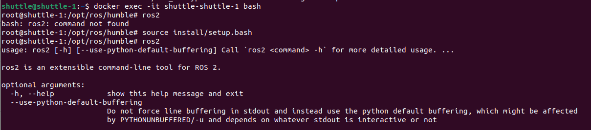

# Prise en main

## Assemblage

Pour plus de précision, cf [getting started](https://gitlab.univ-lorraine.fr/coll/l-inp/ensem/plateforme_pedagogique_urbanloop/plateau_capteurs/shuttle-sensor-tray/-/blob/main/doc/source/getting_started.rst?ref_type=heads)

- Plateau assemblé



- Connexion au réseau éthernet de l'école



## Accès au plateau de capteurs

Les interfaces réseaux de la carte ont tendance à être désactivées au lancement de l’OS. Aller dans **Settings->Network** et vérifier que **mgbe0** et **mgbe1** sont activées.

**Compte ubuntu**
- User
```
shuttle
```
- Password
```
urbanl00p
```
**Connexion à distance**

- Adresse IP
```
100.64.212.88
```
- connexion avec ssh
``` bash
ssh shuttle@100.64.212.88
```

## Lancement des capteurs

Pour voir plus de détail, voir [getting_started](https://gitlab.univ-lorraine.fr/coll/l-inp/ensem/plateforme_pedagogique_urbanloop/plateau_capteurs/shuttle-sensor-tray/-/blob/main/doc/source/getting_started.rst?ref_type=heads).

**Lancement**
``` bash
docker compose -f docker-compose.slam.yml up -d
```

**Arrêt**
``` bash
docker compose -f docker-compose.slam.yml down
```

## Utilisation des fonctionnalités du plateau

**Liste des containers**
``` bash
docker ps
```


**Accès à ROS2**

Pour utiliser ros2 sur la jetson, il faut se mettre sur un container docker

- Sélectionner un container

``` bash
docker exec -it shuttle-shuttle-1 bash
```

- source install/setup.bash

Vous devrez exécuter cette commande sur chaque nouveau terminal que vous ouvrez pour avoir accès aux commandes ROS 2

``` bash
source install/setup.bash
```



