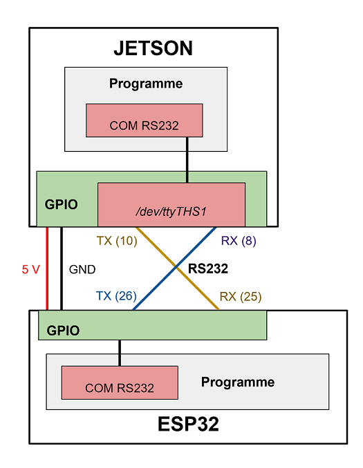

# RS232 esp32-jetson

## Objectif

Exemple pour établir une communication entre une carte ESP32 et une carte JETSON nano via une liaison RS232.

***

## ESP32

### Lancement du programme
La compilation et le téléversement du programme sur l'ESP32 se fait directement avec PlateformIO.

### Projet VS Code
Les librairies (dossier .pio) ne sont pas sur le git mais sont  à récupérer avec PlateformIO *(par exemple en créant un nouveau projet avec le "Board" et le "Framework" indiqués ci-dessous)*.

- Extension [PlatformIO](https://marketplace.visualstudio.com/items?itemName=platformio.platformio-ide)
- Board : Espressif ESP32 Dev Module
- Framework : Arduino

### Connexion RS232
- RX : pin 26
- TX : pin 25
- Baude rate : 9600

***
## JETSON


### Lancement du programme

```
sudo python3 JETSON/RS232.py
```


### Connexion RS232
*(cf [Jetson Nano GPIO Header PINOUT](https://jetsonhacks.com/nvidia-jetson-nano-j41-header-pinout/))*
- port : /dev/ttyTHS1
- RX : pin 8
- TX : pin 10
- Baude rate : 9600

***
## Schema de câblage 


