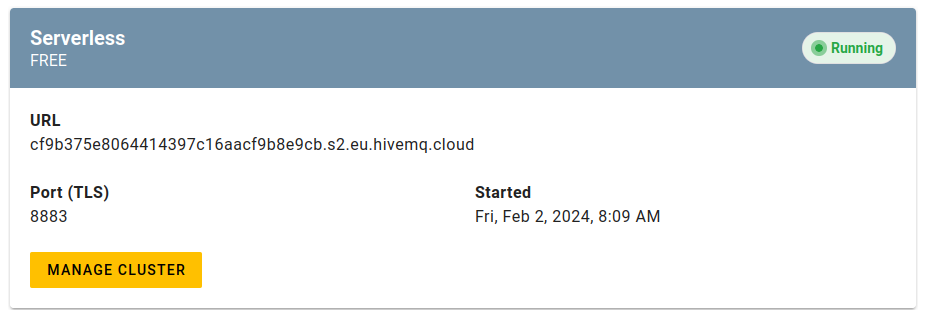
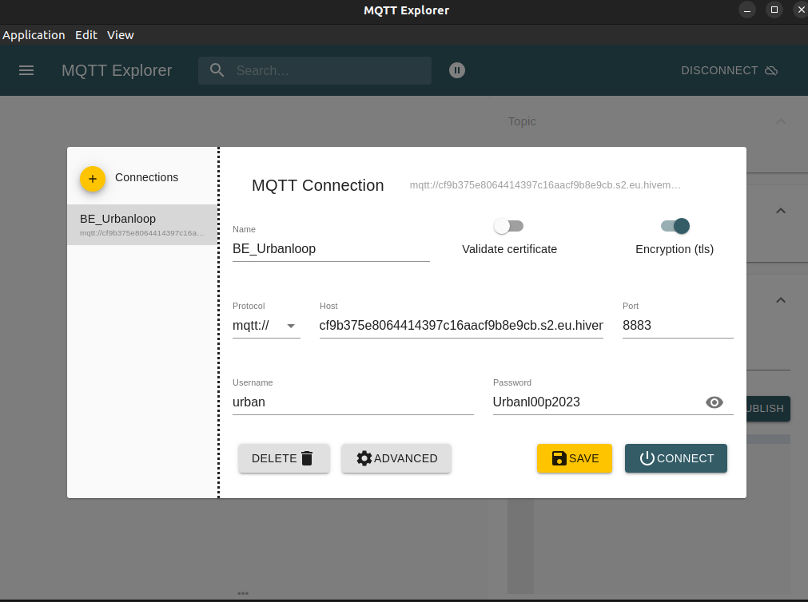
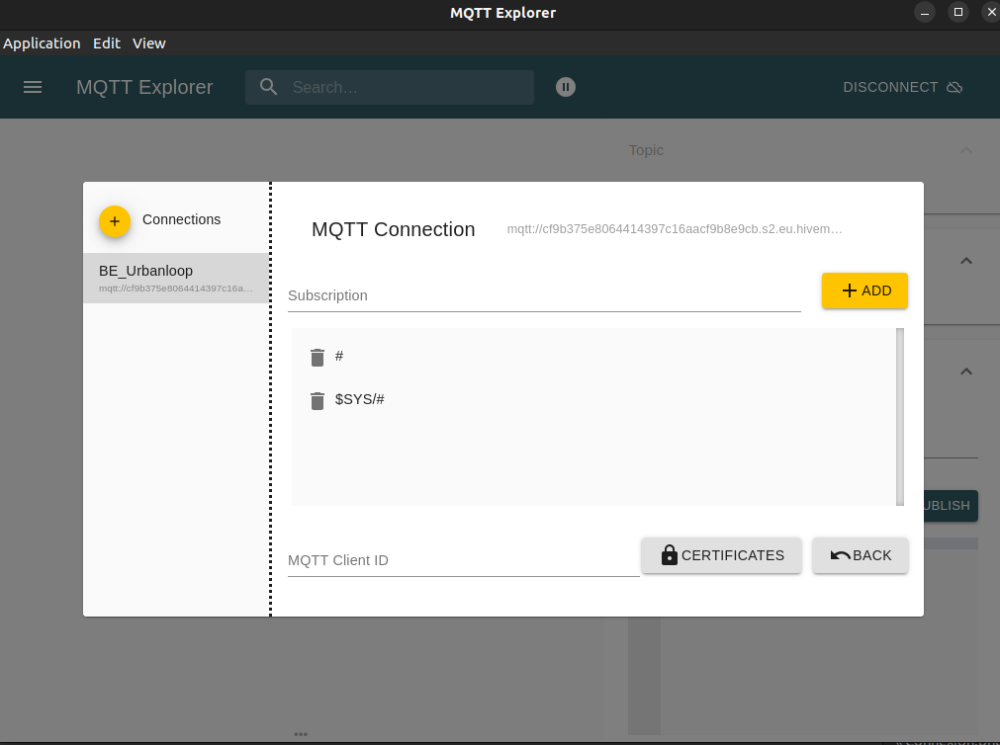
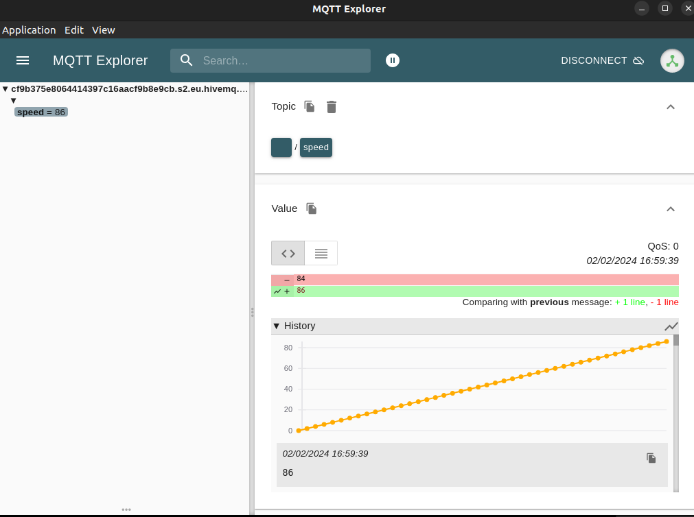

# MQTT

## MQTT Broker

Le serveur MQTT est hébergé sur le site [hivemq](http://broker.hivemq.com)

**Identification** (publication et souscription)
- Username : ``` urban ```
- Password : ``` Urbanl00p2023 ```

**Adressage**
- Cluster URL : ```cf9b375e8064414397c16aacf9b8e9cb.s2.eu.hivemq.cloud```
- Port : ```8883```



## MQTT Explorer

MQTT Explorer est une apllication permettant d'intéragir avec un MQTT Broker

- 

- **Connexion** 

Ici, la connexion se fait de manière sécurisé (tls activé). Il faut donc ajouter ```:8883/mqtt``` à l'adresse


Il faut également supprimer le champ Client Id dans la rubrique *ADVANCED*


## Exemple

Publication de la vitesse périodiquement sur le topic /speed avec le script [test_mqtt](test_mqtt.py)

- **Installation**

Le script utilise la bibliothèque python [paho-mqtt](https://pypi.org/project/paho-mqtt/)
``` bash
pip install paho-mqtt
```

- **Lancement**
``` bash
python3 test_mqtt.py
```

- **Visualisation avec MQTT Explorer**
